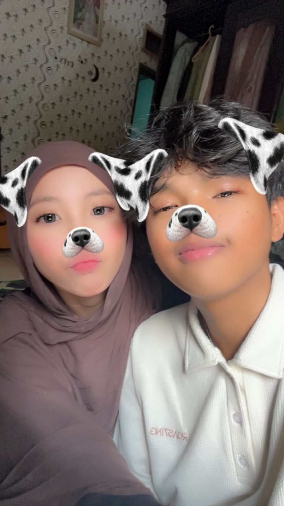

# birthday-sayangg
│
├── index.html
├── style.css
├── script.js
│
├── assets/
│   ├── photo1.jpg
│   ├── photo2.jpg
│   ├── photo3.jpg
│   └── music.mp3   (opsional)
│
└── README.md

<!DOCTYPE html>
<html lang="id">
<head>
<meta charset="UTF-8">
<meta name="viewport" content="width=device-width,initial-scale=1.0">
<title>For Ayla ❤️</title>

<link rel="stylesheet" href="style.css">

<link rel="preconnect" href="https://fonts.googleapis.com">
<link href="https://fonts.googleapis.com/css2?family=Poppins:wght@300;500;700&family=Great+Vibes&display=swap" rel="stylesheet">
</head>

<body>

<h1>🔒 Secret Page</h1>

Masukkan Password

<input id="password" type="password" placeholder="Password">

<button onclick="login()">Masuk ❤️</button>

<h1 class="title">My Dearest Ayla ❤️</h1>

Happy Birthday Ayla 🤍
  

Semoga di umur yang baru ini semua impianmu tercapai.

Terima kasih sudah menjadi bagian terindah dalam hidupku.

Semoga kita selalu bersama dan saling menjaga.

Aku sayang kamu lebih dari kata-kata yang bisa aku tulis.

Happy Birthday once again.

I Love You ❤️

<h2>With Love, Bryan</h2>

<audio autoplay loop controls>

<source src="assets/music.mp3" type="audio/mpeg">

</audio>

</body>
</html>

body{

margin:0;

font-family:Poppins;

background:#ffd9e8;

text-align:center;

overflow-x:hidden;

}

#main{

display:none;

padding:30px;

animation:fade 1.5s;

}

#login{

margin-top:120px;

}

input{

padding:15px;

width:250px;

border-radius:15px;

border:none;

}

button{

padding:15px 30px;

border:none;

border-radius:20px;

background:#ff4f8b;

color:white;

font-size:18px;

margin-top:20px;

cursor:pointer;

}

.slider img{

width:300px;

height:400px;

object-fit:cover;

border-radius:20px;

box-shadow:0 10px 30px rgba(0,0,0,.3);

}

.title{

font-family:"Great Vibes";

font-size:60px;

color:#d81b60;

}

.letter{

max-width:700px;

margin:auto;

font-size:20px;

line-height:35px;

}

h2{

font-family:"Great Vibes";

font-size:45px;

color:#d81b60;

}

@keyframes fade{

from{

opacity:0;

transform:translateY(40px);

}

to{

opacity:1;

transform:translateY(0);

}

}

function login(){

let pass=document.getElementById("password").value;

if(pass=="1807"){

document.getElementById("login").style.display="none";

document.getElementById("main").style.display="block";

}else{

document.getElementById("error").innerHTML="Password Salah";

}

}

const photos=[

"assets/photo1.jpg",

"assets/photo2.jpg",

"assets/photo3.jpg"

];

let i=0;

setInterval(()=>{

i++;

if(i>=photos.length)i=0;

document.getElementById("slide").src=photos[i];

},3000);
